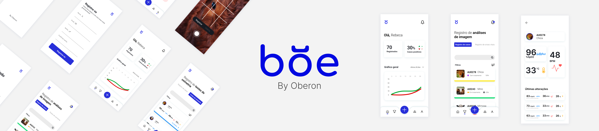
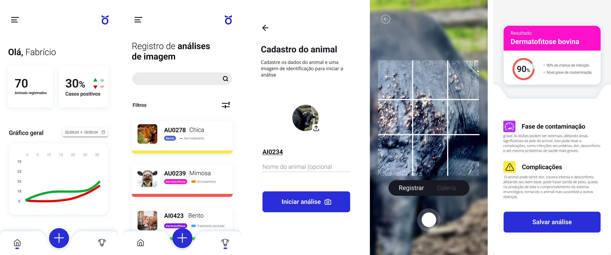

<h1 align="center">BOE's Mobile App</h1>

Este projeto foi criado com o intuito de auxiliar o processo de diagnóstico das doenças dermatológicas em bovinos, especificamente: o berne, a dermatofitose bovina, a dermatofilose bovine e a dermatite nodular contagiosa, acelerando-o. Isso pode ser feito com o uso de Aprendizagem Profunda, uma subárea da Inteligência Artificial. A arquitetura do BOE é composta por 4 desenvolvimentos: [BoeMobileApp](https://github.com/isefshondo/BoeMobileAppV2), [BoeWebDashboard](https://github.com/RebecaBaruch/boe-web-dashboard), [BoeBff](https://github.com/isefshondo/BoeApiV2) e [BoeAI](https://github.com/mayarakaren/IA-Boe).



> [!NOTE]
> É importante ressaltar que este trabalho não substitui um profissional da medicina veterinária.

## Funcionalidades

Este repositório aborda a aplicação para dispositivos móveis.



Tem-se como suas funcionalidades as seguintes:

- **Cadastro do animal**
- **Câmera ou Upload de Imagens**
- Cadastro e Login de Usuário
- Visualização de dados estatísticos (Por números e gráficos)
- Edição de dados pessoais
- Listagem de animais (Dados principais e de maior relevância do animal em explícito)
- Visualização macro dos detalhes do animal (Incluindo seu histórico)

## Pré-requisitos para funcionamento íntegro

- Node
- Visual Studio Code
- Expo Go (Aplicativo disponível na [Play Store]() ou [Apple Store]())

## Dependências

Para que possa experenciar todas as funcionalidades que a aplicação tem a oferecer, é **preciso** que as seguintes dependências sejam instaladas e executados simultaneamente à execução desta aplicação:

- [BoeBff](https://github.com/isefshondo/BoeApiV2)
- [BoeAI](https://github.com/mayarakaren/IA-Boe)

## Configuração do BOE

1. Após ter clonando, de acordo com seus respectivos READMEs, os repositórios acima, clone este repositório em sua máquina:

```
git clone https://github.com/isefshondo/BoeMobileAppV2.git
```

2. Abra este repositório em seu Visual Studio

3. Instale suas dependências

   - Em seu terminal - esteja certo de que ele se encontra dentro deste repositório - execute o seguinte comando:

   ```
   npm ci
   ```

4. Procure por todas as requisições feitas e substitua o IP fixado na requisição pelo IP de sua própria máquina

5. Certifique-se de que tanto esta aplicação e o seu dispositivo móvel estejam na mesma rede

6. Execute o seguinte comando:

```
npx expo start -c
```

7. Abra seu Expo Go em seu dispositivo móvel e escolha a maneira como desejará abrir o APP, existem duas formas:
   - Escaneie o QR Code que aparece em seu terminal; ou
   - Digite a URL que aparece em seu terminal.

## Quer contribuir com a melhora desta aplicação?

É simples! Em uma branch separada, implemente suas sugestões e abra uma Pull Request! Você pode colocar como revisores os seguintes perfis:

- [Isabelle (@isefshondo)](https://github.com/isefshondo)
- [Mayara (@mayarakaren)](https://github.com/mayarakaren)
- [Nayara (@NahAzevedo)](https://github.com/NahAzevedo)
- [Rebeca (@RebecaBaruch)](https://github.com/RebecaBaruch)

## Tecnologias


&nbsp;
